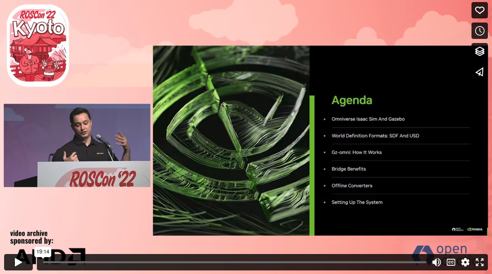

Gazebo version | Branch
-- | --
Fortress | [fortress](https://github.com/gazebosim/gz-usd/tree/fortress) |
Garden and higher versions | [main](https://github.com/gazebosim/gz-usd) |

USD is a high-performance extensible software platform for collaboratively constructing animated 3D
scenes, designed to meet the needs of large-scale film and visual effects production.

This repo provides tools to convert between SDF and USD files.

**USD requires CMAKE 3.12; this package is available from Ubuntu 20.04**

# Tutorials

If you have already installed `gz-usd` you might want to visit [the tutorial section](./tutorials/README.md).

# Build Instructions

We will build USD and gz-usd in a colcon workspace
* Create a workspace

  ```bash
  mkdir ~/gz-usd-ws
  ```

* Clone USD and gz-usd in the workspace. Note: Only v21.11 supported currently

  ```bash
  mkdir ~/gz-usd-ws/src
  cd ~/gz-usd-ws/src
  git clone --depth 1 -b v21.11 https://github.com/PixarAnimationStudios/USD.git
  git clone https://github.com/gazebosim/gz-usd
  ```


* Install system dependencies

    ```bash
    sudo apt install libpyside2-dev python3-opengl cmake libglu1-mesa-dev freeglut3-dev mesa-common-dev
    ```
    Use the build script to compile USD. In order to speed up compilation, it is recommended to disable unneeded components.

* Build workspace
  
  ```bash
colcon build --merge-install --mixin compile-commands --cmake-args  -DPXR_ENABLE_PYTHON_SUPPORT=FALSE -DPXR_ENABLE_GL_SUPPORT=FALSE -DPXR_BUILD_IMAGING=FALSE -DPXR_BUILD_TUTORIALS=FALSE -DPXR_BUILD_EXAMPLES=FALSE -DPXR_BUILD_TESTS=FALSE -DPXR_BUILD_USD_TOOLS=FALSE

  ```

```

You should now have an executable named `sdf2usd` in the `./build/bin` directory.
This executable can be used to convert a SDF world file to a USD file.
To see how the executable works, run the following command from the `./build/bin` directory:
```bash
./sdf2usd -h
```


### Note about building with colcon

You may need to add the USD library path to your `LD_LIBRARY_PATH` environment variable after sourcing the colcon workspace.
If the USD library path is not a part of `LD_LIBRARY_PATH`, you will probably see the following error when running the `sdf2usd` executable:

```bash
sdf2usd: error while loading shared libraries: libusd_usd.so: cannot open shared object file: No such file or directory
```

The typical USD library path is `<usd_installation_path>/lib`.
So, if you installed USD at `/usr/local/USD`, the following command on Linux properly updates the `LD_LIBRARY_PATH` environment variable:
```bash
export LD_LIBRARY_PATH=$LD_LIBRARY_PATH:/usr/local/USD/lib
```

Another thing to note if building with colcon is that after sourcing the workspace with sdformat,
the `sdf2usd` executable can be run without having to go to the `./build/bin` directory.
So, instead of going to that directory and running `./sdf2usd ...`, you should be able to run `sdf2usd ...` from anywhere.

## ROSCon 2022

[](https://vimeo.com/767140085)
