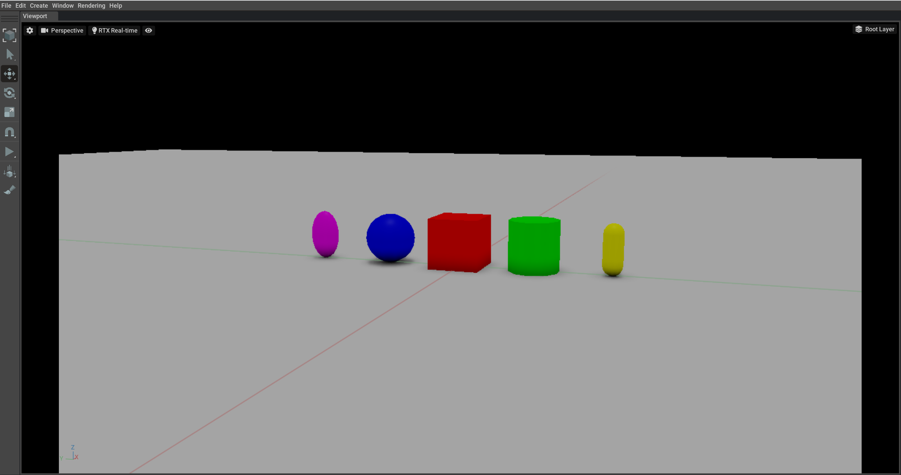

# Convert SDF to USD

## Prerequisites

* Compile [gz-usd](https://github.com/gazebosim/gz-usd/blob/main/README.md).
* Omniverse Create.

### Installing Omniverse Create

Download Omniverse from https://www.nvidia.com/en-us/omniverse/.

After logging in to the launcher, go to the "Exchange" tab and search for "Create". After installing it, you can launch it from the "Library" tab.

### Convert SDF to USD

If `gz-usd` is built, there should be a `sdf2usd` cli program.

```bash
SDF to USD converter
Usage: sdf2usd [OPTIONS] [input] [output]

Positionals:
  input TEXT                  Input filename. Defaults to input.sdf unless otherwise specified.
  output TEXT                 Output filename. Defaults to output.usd unless otherwise specified.

Options:
  -h,--help                   Print this help message and exit
  --help-all                  Show all help
  --version                   
```

Example of converting sdf to usd

*Note: The format of the output depends on the extension, use `.usd` to create a USD binary file instead.*

To convert [shapes_world.sdf](https://github.com/gazebosim/sdformat/blob/sdf12/test/sdf/shapes_world.sdf) to its USD representation as a file called `shapes.usd`, run the following commands:

```bash
wget https://raw.githubusercontent.com/gazebosim/sdformat/sdf12/test/sdf/shapes_world.sdf
./sdf2usd shapes_world.sdf shapes.usd
```

Test the result by opening it in Omniverse Create.

<!--TODO: Bug in sdf2usd? Some shapes are clipping through the plane-->


You can now view the contents of the generated USD file with `usdcat` (this should have been installed when setting up the USD dependency):

```bash
usdcat shapes.usd
```

To see the visual representation of the USD world, run `usdview` (this should have also been installed when setting up the USD dependency):

```bash
usdview shapes.usd
```
